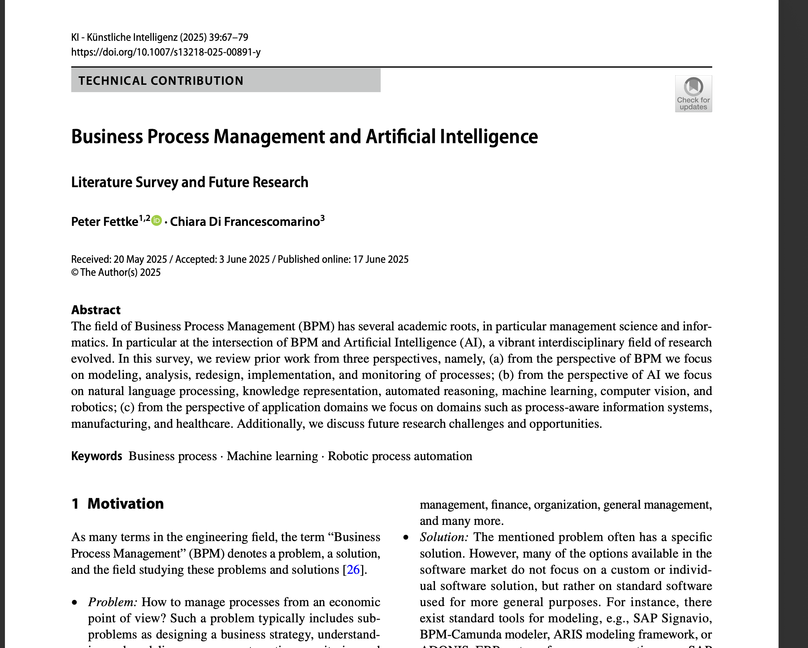
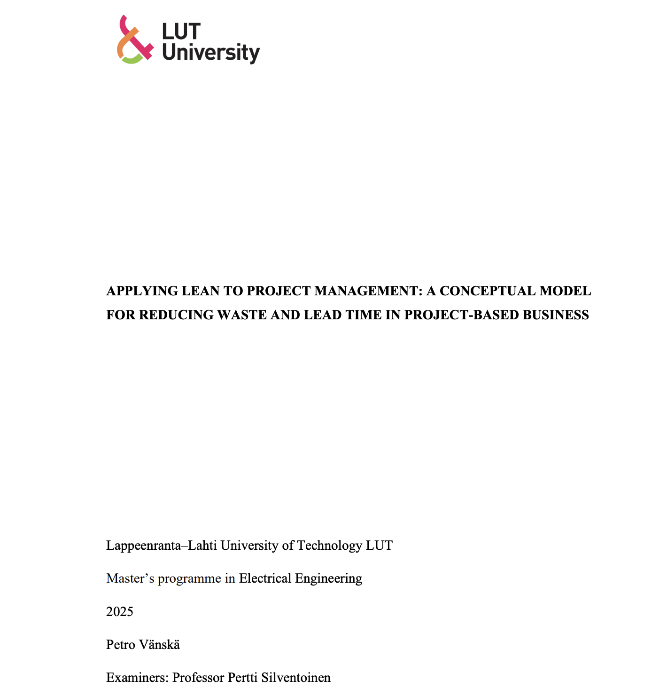
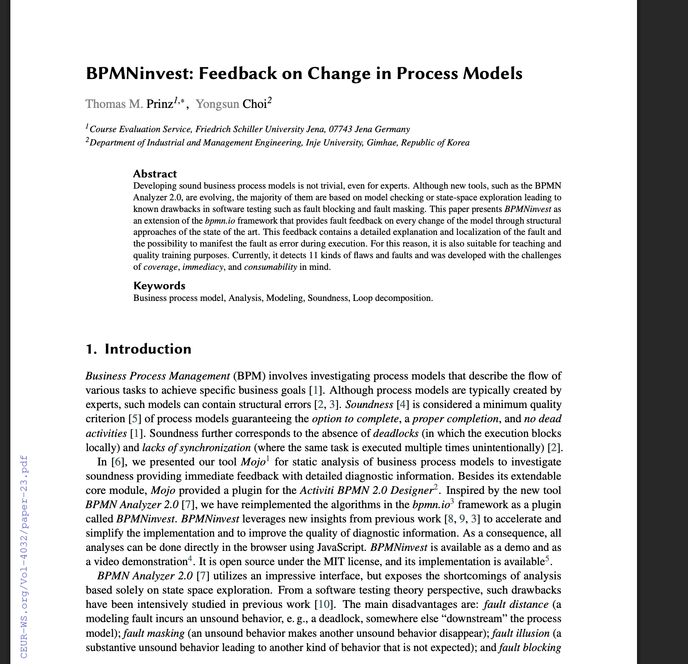
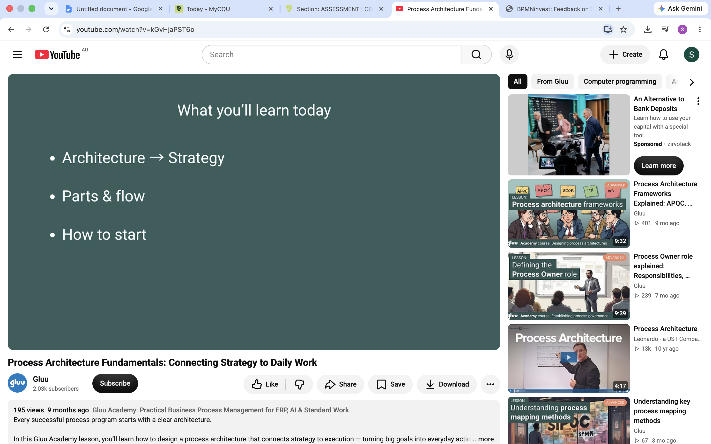

# COIT20252 Business Process Management-e-portfolio-2  
---  
- Name: Sheikh Tanvi Mahmud  
- ID: 12297656  
- Term: 2  
- Year: 2026  
- Tutor: Shakir Karim  
  
# Business Process Modelling  
---  

## AI-Supported Business Process Management  
**Artefact type:** peer reviewed journal article  
**Link:** https://link.springer.com/article/10.1007/s13218-025-00891-y  
  
  
  
Fettke and Di Francescomarino describe how artificial intelligence can help during each stage of the BPM lifecycle. In process redesign, the use of AI will allow calculation of alternative paths, schedule optimization and adaptation of processes to new requirements. Process monitoring can also be done using AI to analyse process execution and predict future processes. Nevertheless, organizational and technological aspects should be considered in implementation of the redesigned process (Fettke & Di Francescomarino 2025, pp. 69–73).  

I selected this artefact because it extends the lecture’s explanation of logical and physical process design. From this paper, I learned that AI can help determine both what activities should be performed and how technology can support their execution. However, analysts should redesign a process before automating it. Automating a poorly designed process may simply reproduce its existing problems. Therefore, AI recommendations should be evaluated by process owners, employees and subject-matter experts before implementation.   
**Reference:**  
Fettke, P & Di Francescomarino, C 2025, ‘Business process management and artificial intelligence: literature survey and future research’, KI – Künstliche Intelligenz, vol. 39, pp. 67–79, viewed 29 August 2026, https://doi.org/10.1007/s13218-025-00891-y.  

## Lean Waste Reduction in Project Processes    
**Artefact type:** Master's Thesis  
**Link:** https://lutpub.lut.fi/handle/10024/170052  
  
  
  
Vänskä analyzes the possibilities to cut the activities that do not add value to the processes and shorten the project lead time through Lean management principles. The waste is classified into eight categories including transportation, inventory, motion, waiting, overproduction, overprocessing, defects and unutilized skills of employees. A step-by-step implementation model is designed which involves identification of customer value, current state assessment, identification of wastes, planning improvements, measuring performance and continuous improvement (Vänskä 2025, pp. 26-30, 90-101).    
  
This artefact was chosen because the waste categories identified coincide with those mentioned in Week 6 lecture. From the thesis I have learned that it is essential to start process re-design from understanding what provides value to customers. Any activities that do not add value must be eliminated, simplified or controlled. Through measures like lead time, work-in-progress, throughput, and flow efficiency one may show whether the re-designed process works better than the previous one.    
**Reference:**  
Vänskä, P 2025, Applying Lean to project management: a conceptual model for reducing waste and lead time in project-based business, master’s thesis, Lappeenranta–Lahti University of Technology LUT, viewed 30 August 2026, https://lutpub.lut.fi/handle/10024/170052.   

## Detecting Errors in BPMN Models  
**Artefact type:** Conference paper  
**Link:** https://www.researchgate.net/profile/Thomas-Prinz-3/publication/395710212_BPMNinvest_Feedback_on_Change_in_Process_Models/links/68d0deddd221a404b2a1858b/BPMNinvest-Feedback-on-Change-in-Process-Models.pdf  
  
  
  
Prinz and Choi have developed BPMNinvest, which is an open source tool used to analyse any BPMN models after changes made by the modeler. The current tool identifies 11 different errors and defects in the models including deadlocks, infinite loops, errors in the gateways and synchronization issues. It identifies such errors and flaws and gives explanations, recommendations for repairs and simulation on its analysis (Prinz & Choi 2025, pp. 168-171).  

The artefact was chosen since it shows how process models can be used to carry out verification and quality assurance. From the article, I learnt that a diagram may be visually perfect but contain defects that make it impossible to execute successfully. This links to repository governance since organizations have to verify the quality of models before publishing them in repositories.  
**Reference:**  
Prinz, TM & Choi, Y 2025, ‘BPMNinvest: feedback on change in process models’, in H Reijers et al. (eds), Joint proceedings of the Best Dissertation Award, Doctoral Consortium, and Demonstration and Resources Forum at BPM 2025, CEUR Workshop Proceedings, vol. 4032, pp. 168–175, viewed 27 August 2026, https://ceur-ws.org/Vol-4032/paper-23.pdf.    

## Process Architecture from Strategy to Work   
**Artefact type:** Youtube Video  
**Link:** https://www.youtube.com/watch?v=kGvHjaPST6o    
  
  
  
Gluu defines process architecture as a systematic approach that enables the connection of the organizational strategy to everyday work. Gluu demonstrates that an organization can start from its strategic objectives and value chain before subdividing its business into process groups, end-to-end processes, workflows, and tasks (Gluu 2025, 0:00-2:21).  
  
This artifact was chosen due to its visual representation being close to four modeling levels discussed during the lecture: executive, business, operational, and task levels. From the video, I found out that a single process map cannot contain enough information for different audiences. The higher management needs a process landscape, while the operational staff needs activities, responsibilities, and instructions. Thus, creating connected levels of modeling is helpful for communication, process ownership, and strategy implementation.  
**Reference:**  
Gluu 2025, ‘Process architecture fundamentals: connecting strategy to daily work’, YouTube, viewed 28 August 2026, https://www.youtube.com/watch?v=kGvHjaPST6o.  

## AI Disclosure  
I utilised generative AI tools for planning, idea development, and research.
Specifically, ChatGPT by OpenAI (2026) was used to support language structuring and concept refinement.  

  

