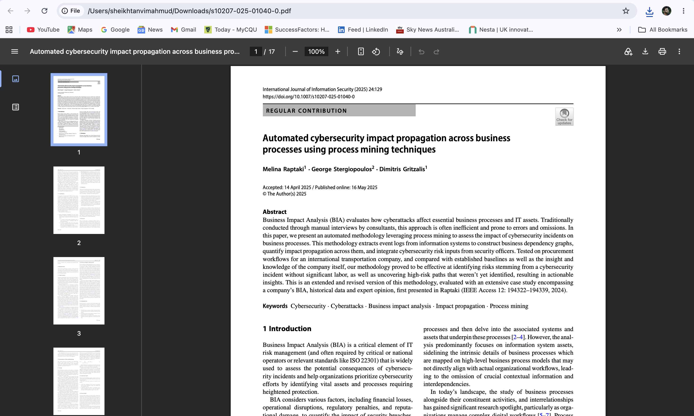
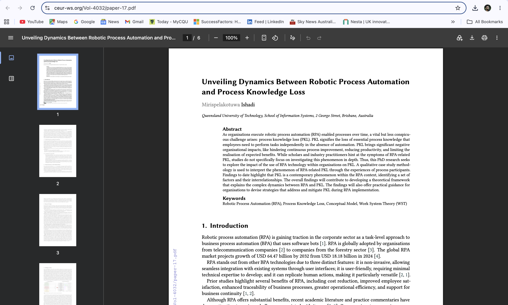
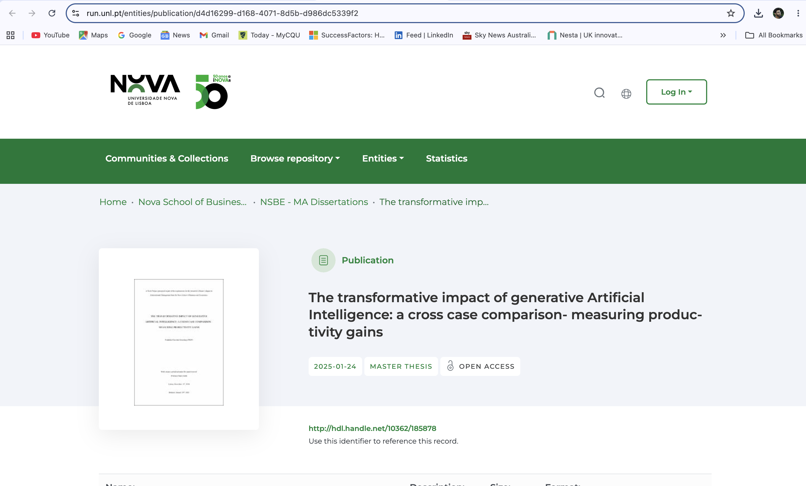
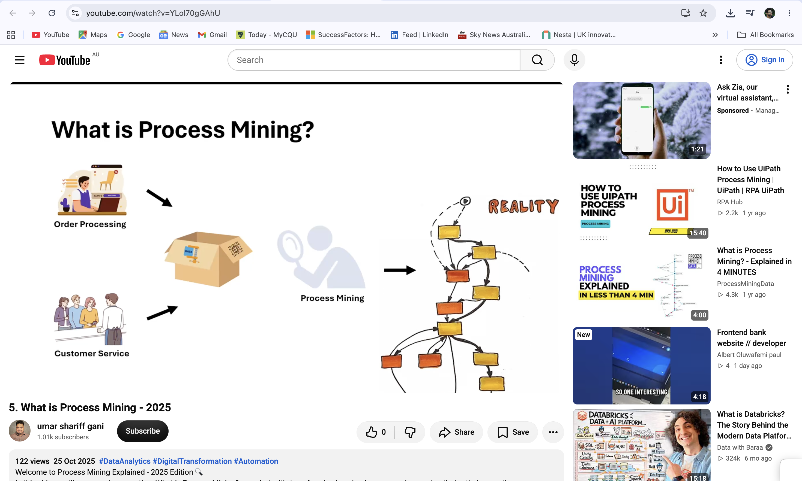

# COIT20252 Business Process Management-e-portfolio-3    
---  
- Name: Sheikh Tanvi Mahmud  
- ID: 12297656  
- Term: 2  
- Year: 2026  
- Tutor: Shakir Karim  
  
# Robotic Process Automation and Process Cybersecurity  
---  

## Process Mining for Cybersecurity Impact Analysis    
**Artefact type:** peer reviewed journal article  
**Link:** https://link.springer.com/article/10.1007/s10207-025-01040-0
  
  
  
Raptaki, Stergiopoulos and Gritzalis present an automated method that uses process mining to assess how cybersecurity incidents affect business processes. The method analyses event logs from organisational systems, constructs process dependency graphs and identifies how the effects of an incident may spread between connected activities. Testing on a transportation company’s procurement process revealed high-risk pathways that its existing assessment had overlooked (Raptaki, Stergiopoulos & Gritzalis 2025).  

This artefact was chosen as it relates to both process mining and process cybersecurity, which are the main subjects discussed in Week 8. The knowledge gained from this paper shows that during the process of cybersecurity analysis, the processes related to technology usage must be taken into account. Event logs will provide information about the actual performance of the work by both people and technological systems.  
**Reference:**  
Raptaki, M, Stergiopoulos, G & Gritzalis, D 2025, ‘Automated cybersecurity impact propagation across business processes using process mining techniques’, International Journal of Information Security, vol. 24, article 129, viewed 18 September 2026, https://doi.org/10.1007/s10207-025-01040-0

## RPA and Process-Knowledge Loss    
**Artefact type:** Conference paper  
**Link:** https://ceur-ws.org/Vol-4032/paper-17.pdf  
  
  
Mirispelakotuwa considers the connection between RPA and organisational process knowledge loss. RPA can increase efficiency by assigning routine tasks to software robots rather than employees. Nonetheless, significant automation can negatively affect employee knowledge about the process since they will not carry out the process activities anymore. Such situations are dangerous for automation in case there is any failure or need for changes (Mirispelakotuwa 2025, pp. 120-127). This paper was published within the proceedings of the BPM 2025 Doctoral Consortium.  

This artefact is chosen because it discusses one of the limitations of RPA which might be overlooked by organisations. From this paper, I have learnt that in the course of automation decision-making, attention should be paid not only to saving time and money but also to knowledge acquisition and retention.     
**Reference:**  
Mirispelakotuwa, IUM 2025, ‘Unveiling dynamics between robotic process automation and process knowledge loss’, in H Reijers et al. (eds), Joint proceedings of the Best Dissertation Award, Doctoral Consortium, and Demonstration and Resources Forum at BPM 2025, CEUR Workshop Proceedings, vol. 4032, pp. 120–127, viewed 18 September 2026, https://ceur-ws.org/Vol-4032/paper-17.pdf  

## Change Management for Generative AI 
**Artefact type:** Master’s thesis    
**Link:** https://run.unl.pt/entities/publication/d4d16299-d168-4071-8d5b-d986dc5339f2
  
  
  
Scheiding discusses the organisational uptake of generative AI via qualitative interviews and an industry-wide survey. The thesis centres around change management, employee engagement, productivity and workflow integration. Scheiding concludes that successful implementation involves leadership involvement, communication, and ongoing training for the employees. Organisations need to tailor their approach to suit their own workforce and circumstances (Scheiding 2025).  

This artefact was chosen because it showcases the change-management strategies from Week 9 that are based on people. From this thesis, I found out that technology change alters the duties and relationships between people at work. Leadership has to motivate the change, get employees involved in implementing it and train them in this context. Communication could help eliminate ambiguity and inspire trust. Thus, project management and change management must go hand-in-hand to accomplish the desired business goal.  
**Reference:**  
Scheiding, FC 2025, The transformative impact of generative artificial intelligence: a cross-case comparison—measuring productivity gains, master’s thesis, Nova School of Business and Economics, Universidade Nova de Lisboa, viewed 22 September 2026, http://hdl.handle.net/10362/185878  

## Understanding Process Mining
**Artefact type:** Youtube Video  
**Link:** https://www.youtube.com/watch?v=YLol70gGAhU
  
  

The video describes process mining as the process through which event logs are used to understand and enhance the organizational processes. The information systems capture the actions, timestamps, and case id as the individuals execute their tasks. Using the process-mining tools, this information is converted to process models that highlight any deviations, delays and the bottlenecks of the process (Process Mining Explained 2025).  

I have chosen this artefact as it provides a clear illustration of a topic covered in week eight that is quite technical. From this video, it can be seen that process mining provides a link between the business process management and organizational data. Process mining enables process discovery, process conformity checking and enhancement of the process. However, it is important for organizations to have complete and accurate event logs since omission of some events or errors in the time stamps will lead to misrepresentation.  
**Reference:**  
Process Mining Explained 2025, ‘What is process mining? – 2025’, YouTube, viewed 20 September 2026, https://www.youtube.com/watch?v=YLol70gGAhU  

## AI Disclosure  
I utilised generative AI tools for planning, idea development, and research.
Specifically, ChatGPT by OpenAI (2026) was used to support language structuring and concept refinement.  

  
